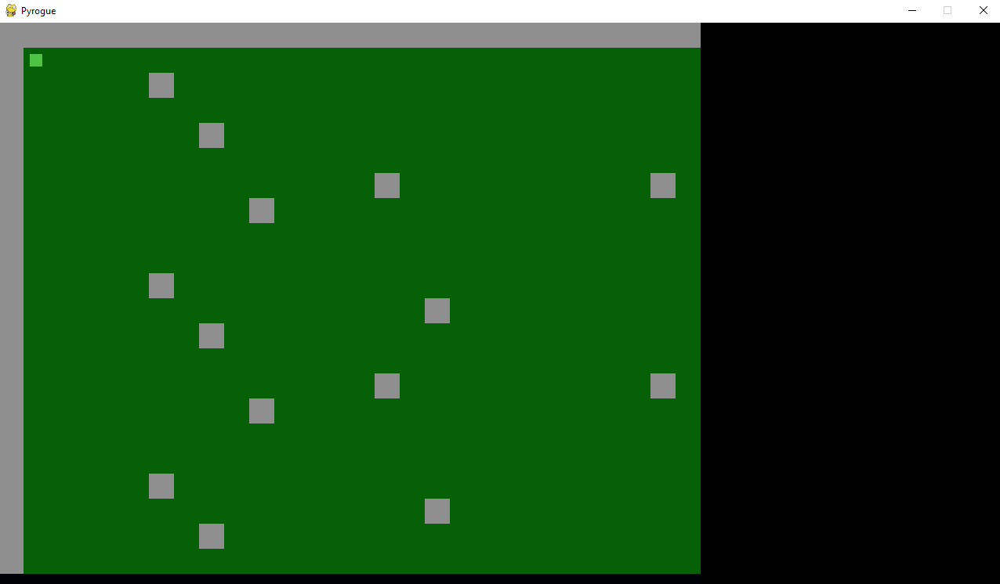
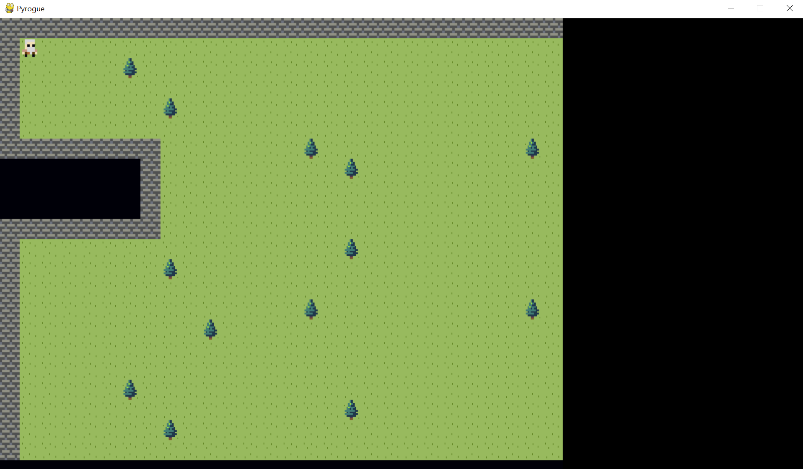
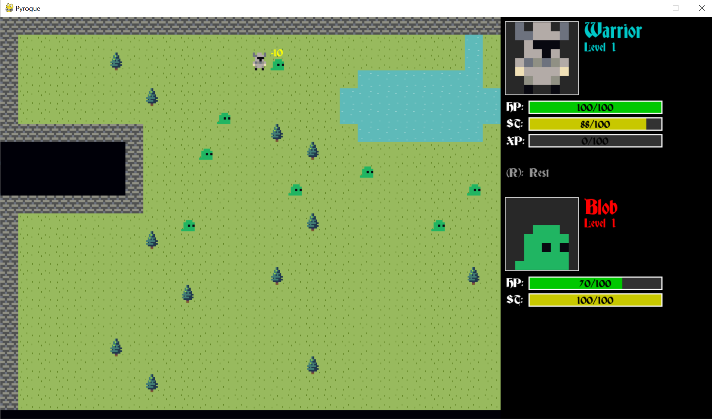

# Pyrogue

This is a simple roguelike game built in Python, as a students exercise of the [Licenciatura em Videojogos][lv] da
[Universidade Lusófona de Humanidades e Tecnologias][ULHT] in Lisbon.

The particle system was built using:
* Python 3.11
* Pygame (https://www.pygame.org/news)

## History
---
[Map loading, movement and camera]

* Tiles can be created, and maps can be loaded from HD using a translation unit (that converts ASCII characters to tiles)
* Player can move around using the arrow keys. Camera will focus on the player at all times

---

[Added sprites]

---

[Stats, enemies and attacks]

* Character archetypes and stats
* UI elements
* Health, stamina and XP system
* Enemy spawning
* Player melee attack
* Combat text

---

[Simple AI introduced]

* Code adapted to be more similar to the code done in class
* AI chase code as done in class (simple controller model)

---

[Introduce Vector2 class]

* Added a Vector2 class to make the code a bit cleaner/easier to read

## Code Files

* pyrogue.py: Entrypoint for the code. Creates tiles, does the main application loop, retrieves input and calls the rendering code
* gamedata.py: Implements the GameData class, and creates the GAMEDATA singleton, through which most of the gamecode runs
* map.py: Implements the Map class, which takes care of the map, including rendering
* maptile.py: Implements the MapTile class, which acts like a prototype of an individual tile. There's only one instance of each map tile (for example, even if the map has 1000 grass tiles, they only point to a single MapTile object)
* character.py: Main character class, used for both the player and enemies. It's responsible for rendering and updating the entity, including moving and attacking
* archetype.py: Implements the Archetype class, which represents a player/enemy class, along with stats and other required assets for displaying
* archetypes.py: This is where the actual definition of the archetypes of the game is done
* combattext.py: Implements the combat text class, which tracks the data needed to display and animate the combat text of the game.
* utilities.py: A series of functions to help with the game. Currently, it only has functions to center text at a certain position and to render a progress bar.

---
## Art
Wall, tree, player character and blob enemy by [Angel] (made available through the [CC0 License])

---
## Licenses

All code in this repo is made available through the [Apache License 2.0] license.
The text are made available through the [CC BY-NC-SA 4.0] license.

---
## Metadata

* Autor: [Diogo Andrade][]

[Diogo Andrade]:https://github.com/DiogoDeAndrade
[Apache License 2.0]:LICENSE
[CC BY-NC-SA 4.0]:https://creativecommons.org/licenses/by-nc-sa/4.0/
[CC0 License]:https://creativecommons.org/publicdomain/zero/1.0/
[ULHT]:https://www.ulusofona.pt/
[lv]:https://www.ulusofona.pt/licenciatura/videojogos
[Map loading, movement and camera]:https://github.com/VideojogosLusofona/pyrogue/tree/3161309040fe1ea4e7cc2caf87d531223e8ae242
[Added sprites]:https://github.com/VideojogosLusofona/pyrogue/tree/7d84785296c63312d5a9f936b2a059ed40b53cf8
[Stats, enemies and attacks]:https://github.com/VideojogosLusofona/pyrogue/tree/d64d6d125ffc54a4af1d3e8fa86b1dd2384f0827
[Introduce Vector2 class]:https://github.com/VideojogosLusofona/pyrogue/tree/df67cf174643ec7200b970c22d365ea7d2b2443b
[Simple AI introduced]:https://github.com/VideojogosLusofona/pyrogue/tree/93e39a6564b405ae7a537e8be6fcbeebe43266ac
[Angel]:https://opengameart.org/users/angel